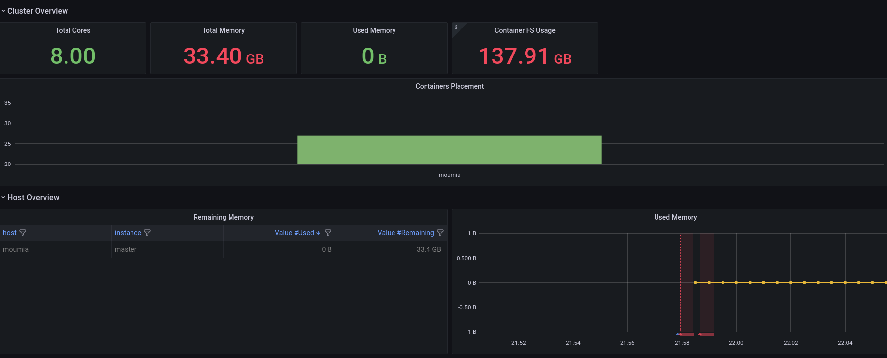

<figure></figure>

# Why Frisbee ?

Frisbee is a next generation testbed tool built for exploring, testing, and benchmarking modern applications. We address
the key pain points developers and QA engineers face when testing cloud-native applications.

We make it possible to:

* **Write tests:**  for stressing complex topologies and dynamic operating conditions.

* **Run tests:**  provides seamless scaling from a single workstation to hundreds of machines.

* **Debug tests:**  through extensive monitoring and comprehensive dashboards


## How can I run a Frisbee experiment ?

To see how Frisbee works, you can install it and run examples of simple workflows. 

Firstly, you'll need a Kubernetes deployment and `kubectl` set-up

* For a single-node deployment click [here](docs/singlenode-deployment.md).

* For a multi-node deployment click [here](docs/cluster-deployment.md).
  


In this walk-through, we assume you have followed the instructions for the single-node deployment.


In one terminal, run the Frisbee controller.

```bash
# Run the Frisbee controller
>> make run
```

We can use the controller's output to reason about the experiments transition. 


On the other terminal, you can issue requests.

```bash
# Create a dedicated Frisbee name
>> kubectl create namespace frisbee

# Run a testplan (from Frisbee directory)
>> kubectl -n frisbee apply -f examples/testplans/0.validate-local.yml
workflow.frisbee.io/validate-local created

# Confirm that the workflow is running.
>> kubectl -n frisbee get pods
NAME         READY   STATUS    RESTARTS   AGE
prometheus   1/1     Running   0          19s
grafana      1/1     Running   0          16s
master       3/3     Running   0          8s

# Wait until the test oracle is triggered.
>> kubectl -n frisbee wait --for=condition=oracle --timeout=3m workflows.frisbee.io/validate-local
workflow.frisbee.io/validate-local condition met
```


## How can I understand what happened ?


One way, is to access the workflow's description

```bash
>> kubectl -n frisbee describe workflows.frisbee.io/validate-local
```


But why bother if you can access Grafana directly ? 

[Click Here](http://grafana.localhost/d/R5y4AE8Mz/kubernetes-cluster-monitoring-via-prometheus?orgId=1&amp;from=now-15m&amp;to=now)


If everything went smoothly, you should see a similar dashboard.





To learn how to build your custom experiment click [here](docs/cluster-deployment.md).


## Bugs, Feedback, and Contributions

The original intention of our open source project is to lower the threshold of testing distributed systems, so we highly
value the use of the project in enterprises and in academia.

For bug report, questions and discussions please
submit [GitHub Issues](https://github.com/CARV-ICS-FORTH/frisbee/issues).

We welcome also every contribution, even if it is just punctuation. See details of [CONTRIBUTING](docs/CONTRIBUTING.md)

For more information, you can contact us via:

* Email: fnikol@ics.forth.gr

## License

Frisbee is licensed under the Apache License, Version 2.0. See [LICENSE](http://www.apache.org/licenses/LICENSE-2.0) for
the full license text.

