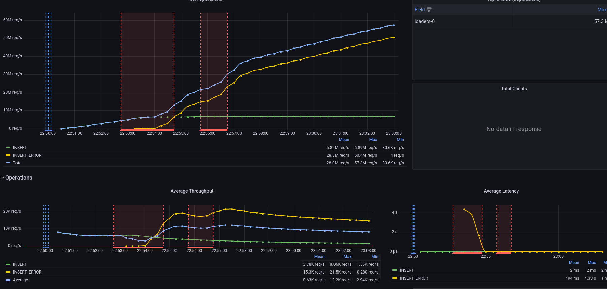
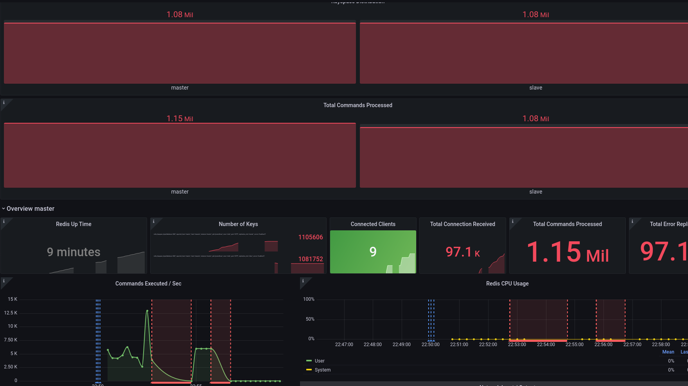

<div align="center">
    <a href="https://www.vectorstock.com/royalty-free-vector/disc-golf-frisbee-eps-vector-25179185">
        
    </a>
</div>

# <div align="center">Frisbee – Kubernetes Native Testbed</div>

The effort being put in automating tests should not take over delivering value to users. Frisbee makes it possible to:

🎁 Setup initial dependency stack – easily!

🏭 Test against actual, close to production software - no mocks!

⏳ Replay complex workloads written in an intuitive language!

🏗️ Combine Chaos Engineering with large-scale performance testing!

🕹️ Assert actual program behavior and side effects


## :compass: Scenarios

* [Logical Dependencies](charts/iperf2/examples/0.server-client.yml)
* [Scheduled Execution](charts/iperf2/examples/1.scheduled-clients.yml)
* [Advanced Placement](charts/iperf2/examples/2.advanced-placement.yml )
* [Conditional Loops](charts/iperf2/examples/3.create-until.yml)
* [Conditional Execution](charts/iperf2/examples/4.create-when.yml)
* [Runtime Assertions](charts/iperf2/examples/5.assertions.yml )
* [Elastic Topologies](charts/iperf2/examples/6.deletions.yml )
* [Recoverability Experiments](charts/iperf2/examples/7.failure-toleration.yml )
* [Time-Driven Chaos Engineering](charts/iperf2/examples/8.time-driven-partition.yml )
* [State-Driven Chaos Engineering](charts/iperf2/examples/9.state-driven-partition.yml)
* [Metrics-Driven Chaos Engineering](charts/iperf2/examples/10.metrics-driven-partition.yml)
* [App-Specific Graceful Shutdowns](charts/cockroachdb/examples/8.scaledown-stop.yml )
* [Failover](charts/redis/examples/10.availability-failover-single.yml )

# TL;DR

1. Make sure that [kubectl](https://kubernetes.io/docs/tasks/tools/install-kubectl-linux/)
and  [Helm](https://helm.sh/docs/intro/install/) are installed on your system.

2. Update Helm repo.

```bash
>> helm repo add frisbee https://carv-ics-forth.github.io/frisbee/charts
```

3. Install Helm Packages.

```bash
# Install the platform
>> helm upgrade --install --wait my-frisbee frisbee/platform
# Install the package for monitoring YCSB output
>> helm upgrade --install --wait my-ycsb frisbee/ycsb
# Install TiKV store
>> helm upgrade --install --wait my-tikv frisbee/tikv
```

4. Create/Destroy the test plan.

```bash
# Create
>> curl -sSL https://raw.githubusercontent.com/CARV-ICS-FORTH/frisbee/main/charts/tikv/examples/plan.baseline.yml | kubectl -f - apply

# Destroy
>> curl -sSL https://raw.githubusercontent.com/CARV-ICS-FORTH/frisbee/main/charts/tikv/examples/plan.baseline.yml | kubectl -f - delete --cascade=foreground
```

If everything went smoothly, you should see a
similar [Grafana Dashboard](http://grafana.localhost/d/R5y4AE8Mz/kubernetes-cluster-monitoring-via-prometheus?orgId=1&amp;from=now-15m&amp;to=now)
.

Through these dashboards humans and controllers can examine to check things like completion, health, and SLA compliance.

#### Client-View (YCSB-Dashboard)



#### Client-View (Redis-Dashboard)



## 📙 Documentation

Frisbee addresses the key pain points developers and QA engineers face when testing cloud-native applications in the
earlier stages of the software lifecycle. We make it possible to:

* **Run tests:**  create temporary containers for application dependencies, setup their initial state and clean them up
in the end.
* **Write tests:** describe complex topologies, dynamic operating conditions, Chaos Events, and distributed assertions.
* **Debug tests:** integrate application-specific metrics, monitor site-wide health metrics, and raise notifications on
SLA violations.

For more information, Frisbee installation and reference documents are available at:

👉 **[Quick Start](docs/tutorial.md)**

👉 **[Test Plans](charts)**

## 🙋‍♂️ Getting Help

We are here to help!

👉 If you face troubles, check the [Frequently Asked Questions](docs/faq.md).

👉 For feature requests and bugs, file an [issue](https://github.com/carv-ics-forth/frisbee/issues).

👉 For great new ideas, browse through the [GitHub discussions](https://github.com/carv-ics-forth/frisbee/discussions).

👉 To get updates ⭐️ [star this repository](https://github.com/carv-ics-forth/frisbee/stargazers).

## ➕ Contributing

The original intention of our open source project is to lower the threshold of testing distributed systems, so we highly
value the use of the project in enterprises and in academia.

We welcome also every contribution, even if it is just punctuation. Here are some steps to help get you started:

✔ Read and agree to the [Contribution Guidelines](docs/CONTRIBUTING.md).

✔ Read Frisbee design and development details on the [GitHub Wiki](https://github.com/carv-ics-forth/frisbee/wiki).

✔ Contact us [directly](fnikol@ics.forth.gr) for other ways to get involved.

## Acknowledgements

This project has received funding from the European Union's Horizon 2020 research and innovation programme under grant
agreement No. 894204 (Ether, H2020-MSCA-IF-2019).
