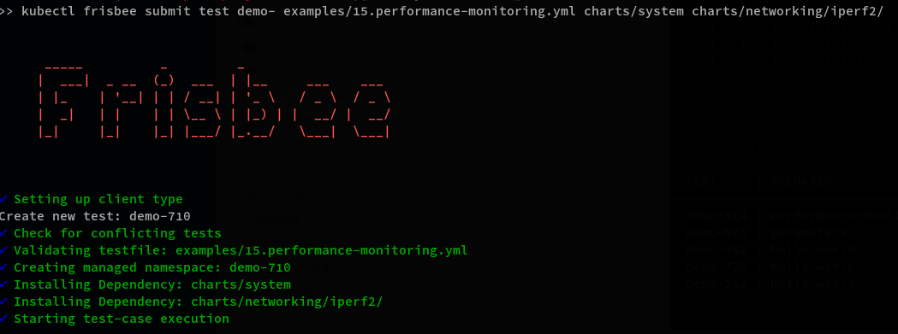

## Frisbee - A Test Automation Framework For Kubernetes

<p align="center">
    <a href="https://www.vectorstock.com/royalty-free-vector/disc-golf-frisbee-eps-vector-25179185">
        
    </a>
</p>


<p align="center">
    <a href="https://frisbee.dev/">Website</a> |
    <a href="https://frisbee.dev/blog">Blog</a> |
    <a href="https://frisbee.dev/docs/">Docs</a> |
    <a href="mailto: fnikol@ics.forth.gr">Contact</a>
    <br /><br />
</p>

<p align="center">
    <a href="https://github.com/carv-ics-forth/frisbee/blob/main/LICENSE">
        
    </a>    
    <a href="https://github.com/carv-ics-forth/frisbee/blob/main/CONTRIBUTING.md">
        
    </a>    
    <a Code build and checks>
        
    </a>        
</p>    

## What is Frisbee ?

Frisbee is a workflow-based engine that lowers the threshold of testing containerized applications on Kubernetes. 

Frisbee is implemented as a set of Kubernetes CRD (Custom Resource Definition) that:

* Setup initial application stack – easily!

* Test against actual, close to production software - no mocks!

* Replay complex workloads written in an intuitive language!

* Combine Chaos Engineering with large-scale performance testing!

* Assert actual program behavior and side effects.

  
To learn more about Frisbee, check the **[QuickStart](https://frisbee.dev/docs/quick-start/)** tutorial or visit our **[Website](https://frisbee.dev)**.

## Use-Cases and Testing Patterns 

👉 [Databases](charts/databases)

👉 [Federated Learning](charts/federated-learning)

👉 [Filesystems](charts/filesystems)

👉 [HPC](charts/hpc)

👉 [Networking](charts/networking)


## Getting Started


#### Step 1. Fix Dependencies

Before starting, Make sure that [kubectl](https://kubernetes.io/docs/tasks/tools/install-kubectl-linux/) and  [Helm](https://helm.sh/docs/intro/install/) are installed on your system.


#### Step 2. Install Frisbee CLI and Frisbee Platform

Then, run the `install.sh`, that will deploy the **Frisbee Terminal**  as an extension to  `kubectl`.

```shell
curl -sSLf https://raw.githubusercontent.com/CARV-ICS-FORTH/frisbee/main/install.sh | bash
```

Through **Frisbee Terminal** we can easily install the **Frisbee Platform**.

```shell
kubectl frisbee install production
```

Finally, download the Frisbee repo from GitHub.

```shell
git clone git@github.com:CARV-ICS-FORTH/frisbee.git
```

This step is not really needed for the installation, but it allows us to access the `examples` and `charts` directories locally.

```shell
>> tree -v  examples/
examples/
├── 1.hello-world.yml
├── 2.parameters.yml
├── 3.execution-order.yml
├── 4.dependency-order.yml
├── 5.clustering.yml
├── 6.time-driven-scheduling.yml
├── 7.event-driven-scheduling.yml
├── 8.conditional-scheduling.yml
├── 9.tolerate-failures.yml
├── 10.resource-throttling.yml
├── 11.advanced-placement.yml
├── 12.callables.yml
├── 13.assertions.yml
├── 14.delete-job.yml
├── 15.performance-monitoring.yml
├── 16.simulate-failure.yml
├── 17.simulate-cascading-failures.yml
├── 18.revoke-failures.yml
├── 19.sla-assertions.yml
├── 20.distributed-logs.yml
├── 21.custom-storage.yml
└── 22.diagnostics.yml
```


### Step 3. Submit a Testing Workflow.


Let's start by running a simple `hello-world`.

```shell
kubectl frisbee submit test demo- ./examles/1.hello-world.yml
```

The name can be explicit (e.g, my-demo), or autogenerated given a prefix followed by a `-` (e.g, demo-).

<p align="center">
    
</p>


To get a list of submitted tests, use.

```shell
kubectl frisbee get tests
```

<p align="center">
    
</p>

Note that every test-case runs on a dedicated namespace (named after the test).

To further dive into execution details use: 

```shell
kubectl frisbee inspect tests demo-482
```


<p align="center">
    
</p>


### Step 4. Progress Monitoring

Notice that the `hello-world` example ended almost immediately.

This, however, is rarely the case. Most frequently, we need a visual way to inspect the `real-time` progress of a test-case (or a deployment). 

For this reason. Frisbee provides `system templates (charts/systems)` for out-of-the-box integration with the Prometheus and Grafana Stack. 


Let's try the `performance-monitoring` example to understand how to use it.

```shell
kubectl frisbee submit test demo- examples/15.performance-monitoring.yml
```

<p align="center">
    
</p>


Oops .... the job has failed. Let's inspect what happened ....

<p align="center">
    
</p>


Aha. There is a missing dependency. We haven't installed the `system templates`. 

To do so, simply `append` the dependencies after the scenario file.

```shell
kubectl frisbee submit test demo- examples/15.performance-monitoring.yml charts/system charts/networking/iperf2
```


Notice that besides the `telemetry templates` (which are part of the `charts/system`), the exact has also dependencies to `iperf` for generating the traffic.

<p align="center">
    
</p>


Instead of using `get` to list the tests and get the `test id`, another way is to take it directly from the `submit` output and use it in `inspect`.

<p align="center">
    
</p>


Given the output, all that it takes to understand the progress for the experiment is to open the URLs of `Visualization Dashboards` in your browser. You can do it by hand, or using this one-liner:

```shell
firefox $(kubectl frisbee inspect tests demo-710 | grep grafana- | awk '{print $3'})
```

Hint: we can create pipelines that open new brower tabs every time you start a new experiment. 

<p align="center">
    
</p>


Notice that in contrast to the vanilla Grafana that plots just the performance metrics, Frisbee also enriches Grafana with `Contextualized Visualizations`. In the previous graph, the `blue vertical lines` provide information on `joining` services, whereas the `orange vertical lines` provide information on `exiting` services. 

Visualization like that helpful in `root-cause analysis`, as it makes it easy to correlate an `observed behavior back to a testing event`. For example, in the next figure, it fairly easy to understand that `INSERT_ERROR` messages (`yellow line`) are triggered by a `fault-injection event`.

<p align="center">
    
</p>


## Features

👉 Workflow templating to store commonly used workflows in the cluster.

👉 DAG based declaration of testing workflows.

👉 Step level input & outputs (template parameterization).

👉 Conditional Execution (Time-Driven, Status-Driven, Performance-Driven).

👉 Live Progress monitoring via Prometheus/Grafana.

👉 Assertions and alerting of SLA violations.

👉 Placement Policies (affinity/tolerations/node selectors).

👉 Archiving Test results after executing for later access.

👉 On-Demand reliable container attached storage.

👉 Garbage collection of completed resources.

👉 Chaos-Engineering and Fault-Injection via Chaos-Mesh.

👉 On-Demand reliable container attached storage.

👉 CLI applications to test management and test inspection. 


To learn how to use these features, check the **[Walkthrough](https://frisbee.dev/docs/walkthrough)** 


## Citation

If you publish work that uses Frisbee, please cite Frisbee as follows:

```bibtex
@article{nikolaidis2021frisbee,
title={Frisbee: automated testing of Cloud-native applications in Kubernetes},
author={Nikolaidis, Fotis and Chazapis, Antony and Marazakis, Manolis and Bilas, Angelos},
journal={arXiv preprint arXiv:2109.10727},
year={2021}
}
```


## Contributing to Frisbee

We welcome contributions. Please see [CONTRIBUTING.md](CONTRIBUTING.md) to get
started!


## Acknowledgements

This project has received funding from the European Union's Horizon 2020 research and innovation programme under grant
agreement No. 894204 (Ether, H2020-MSCA-IF-2019).
