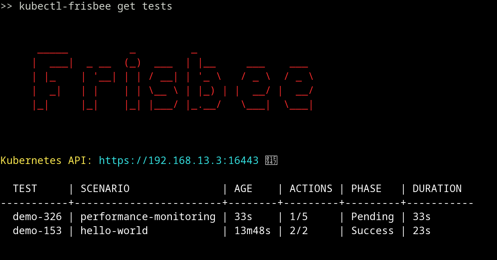

## Frisbee - A Test Automation Framework For Kubernetes

<p align="center">
    <a href="https://www.vectorstock.com/royalty-free-vector/disc-golf-frisbee-eps-vector-25179185">
        
    </a>
</p>


<p align="center">
    <a href="https://frisbee.dev/">Website</a> |
    <a href="https://frisbee.dev/blog">Blog</a> |
    <a href="https://frisbee.dev/docs/">Docs</a> |
    <a href="mailto: fnikol@ics.forth.gr">Contact</a>
    <br /><br />
</p>

<p align="center">
    <a Code build and checks>
        
    </a>        
    <a href="https://github.com/carv-ics-forth/frisbee/blob/main/CONTRIBUTING.md">
        
    </a>    
    <a Releases>
        
    </a>    
    <a Downloads>
        
    </a>
    <a href="https://github.com/carv-ics-forth/frisbee/blob/main/LICENSE">
        
    </a>    
</p>    

## What is Frisbee ?

**Frisbee** is the first Kubernetes framework designed to support **declarative end-to-end testing** of containerized applications.

:heavy_check_mark: Setup application and dependency stack – easily!

:heavy_check_mark: Test against actual, close to production software - no mocks!

:heavy_check_mark: Replay complex workloads written in an intuitive language!

:heavy_check_mark: Combine Chaos Engineering with large-scale performance testing!

:heavy_check_mark: Assert actual program behavior and side effects. 


To learn more about Frisbee, check the **[QuickStart](https://frisbee.dev/docs/quick-start/)** tutorial or visit
our **[Website](https://frisbee.dev)**.


## Use-Cases and Testing Patterns

In declarative testing, a test scenario focuses on what to accomplish rather than on the imperative details of how to manipulate the state of an application under test and verify the final application state against an expected state. 

This approach not make tests more *readable, maintainable, and reproducible*, but it also help devops in identifying testing patterns.

Here, you can see some testing patterns we have identified across different application domains.

👉 [Databases](charts/databases)

👉 [Federated Learning](charts/federated-learning)

👉 [Filesystems](charts/filesystems)

👉 [HPC](charts/hpc)

👉 [Networking](charts/networking)


## Getting Started


### Step 1 – Prerequsities:

To run Frisbee you must access to a running Kubernetes cluster and that [kubectl](https://kubernetes.io/docs/tasks/tools/install-kubectl-linux/)
and  [Helm](https://helm.sh/docs/intro/install/) are installed on your system. If so, skip to the next step.


For quick testing, you can use [microk8s](https://microk8s.io/docs/getting-started). In that case, make sure you have
added the addons and created aliases to the commands.


```shell
sudo microk8s config > ~/.kube/config
sudo microk8s enable dns
sudo microk8s enable ingress
sudo microk8s enable helm3
sudo snap alias microk8s.kubectl kubectl
sudo snap alias microk8s.helm3 helm
```

### Step 2 – Install Frisbee on K8s cluster

Now it's time to get Frisbee from GitHub.

```shell
git clone git@github.com:CARV-ICS-FORTH/frisbee.git
cd frisbee
```

Now, you can inspect the `examples` and `charts` directories.

* [examples](examples): contains a list of test-cases.
* [charts](charts): contains Helm charts that provide templates used in the test-cases.


#### Install Frisbee CLI on your system.
The above will download the project, but not the executables.
For that, you have two options: download the binaries and compile the binaries.

* From binary:
```shell
# Download CLI
./install.sh
# Load CLI binary of the PATH.
export PATH=/usr/local/bin
```

* From source: 
```shell
# Compile CLI
make run
# Load CLI binary of the PATH.
export PATH=$PATH:$(pwd)/bin
```


#### Install Frisbee platform on K8s cluster.
The next step is to install Frisbee in your Kubernetes cluster. You can two options:

* **Development mode:** In this configuration, the Frisbee controller must run manually on the local node. 
The development mode is convenient for developing new functionality on the controller. 

```shell
# Install Frisbee controller outside the k8s cluster.
kubectl-frisbee install development ./ <public address>

# Run the controller manually on the local node.
make run
```

* **Production mode:** The production mode will install the Frisbee controller at yet another container within the cluster.

```shell
# Install Frisbee controller within the k8s cluster.
kubectl frisbee install production

# Follow the controller's output:
kubectl logs -l control-plane=frisbee-operator -n frisbee --follow
```


### Step 3 – Submit a testing job.

Since the majority of Frisbee operations happens through the native CLI, 
it is suggested to enable the autocompletion.
 

```shell
source <(kubectl-frisbee completion bash)
```

As usual, use `tab twice` to get the CLI fields auto-completed.


#### Submit a job

To submit a testing job, the general syntax is:

```shell
kubectl-frisbee submit test <testName> <scenario.yaml> <path to dependent charts>
```

Let's try to run a scenario from the tutorial. 
 
```shell
kubectl-frisbee submit test demo- ./examples/tutorial/15.performance-monitoring.yml ./charts/system/ ./charts/networking/iperf2/
```
* **demo-**: demo is the naming prefix, and the `-` indicate an autogenerated postfix (e.g, demo-326)
* **./examples/tutorial/15.performance-monitoring.yml**: the scenario executes the iperf benchmark and the monitoring stack for observing its execution.
* **charts/systems**: provides the templates for the telemetry stack.
* **charts/networking/iperf**: provides the templates for iperf benchmark.


<p align="center">
    
</p>


#### Inspect Submitted Jobs.

To get a list of submitted tests, use:

```shell
kubectl frisbee get tests
```

<p align="center">
    
</p>


Note that every test-case runs on a dedicated namespace (named after the test). To further dive into execution details
use:

```shell
kubectl frisbee inspect tests demo-326
```

<p align="center">
    
</p>

### Step 4 – Live Progress Monitoring

The last section of `inspect` provides the URLs for accessing Prometheus/Grafana. 

Note that every scenario has its own monitoring stack in order to avoid interfering metrics.

```shell
firefox $(kubectl frisbee inspect tests demo-326 | grep grafana- | awk '{print $3'})
```

<p align="center">
    
    
</p>


In contrast to the vanilla Grafana which plots only the performance metrics, Frisbee
provides `Contextualized Visualizations` that contain information for:

* Joining nodes (blue vertical lines)
* Exiting nodes (orange vertical lines)
* Fault-Injection (red ranges)

Information like that helps in `root-cause analysis`, as it makes it easy to correlate
an `observed behavior back to a testing event`.

For example, in the next figure, it fairly easy to understand that `INSERT_ERROR` messages (`yellow line`) are triggered
by a `fault-injection event`.

<p align="center">
    
</p>

### Step 5 – Auto-generate test reports.

Finally, Frisbee provides an advanced functionality for auto-generating reports for the tests.

```shell
kubectl-frisbee report test demo-326 ~/frisbee-reports --pdf  --force
```

This will create report on `~/frisbee/reports` directory including the pdf from Grafana.


## Features

👉 Workflow templating to store commonly used workflows in the cluster.

👉 DAG based declaration of testing workflows.

👉 Step level input & outputs (template parameterization).

👉 Conditional Execution (Time-Driven, Status-Driven, Performance-Driven).

👉 Live Progress monitoring via Prometheus/Grafana.

👉 Assertions and alerting of SLA violations.

👉 Placement Policies (affinity/tolerations/node selectors).

👉 Archiving Test results after executing for later access.

👉 On-Demand reliable container attached storage.

👉 Garbage collection of completed resources.

👉 Chaos-Engineering and Fault-Injection via Chaos-Mesh.

👉 On-Demand reliable container attached storage.

👉 CLI applications to test management and test inspection.

To learn how to use these features, check the **[Walkthrough](https://frisbee.dev/docs/walkthrough)**.

## Citation

If you publish work that uses Frisbee, please cite Frisbee as follows:

```bibtex
@article{nikolaidis2021frisbee,
title={Frisbee: automated testing of Cloud-native applications in Kubernetes},
author={Nikolaidis, Fotis and Chazapis, Antony and Marazakis, Manolis and Bilas, Angelos},
journal={arXiv preprint arXiv:2109.10727},
year={2021}
}
```

## Contributing to Frisbee

We welcome contributions. Please see [CONTRIBUTING.md](CONTRIBUTING.md) to get
started!

## Acknowledgements

This project has received funding from the European Union's Horizon 2020 research and innovation programme under grant
agreement No. 894204 (Ether, H2020-MSCA-IF-2019).
