# Examples

Source: https://github.com/fnikolai/FDLC

### 1. Baseline

1. Start server
2. Download the dataset into a shared volume that will be shared with the clients.
3. Start 2 clients

| History (~4m) | Loss               | Distributed |
| ------------- | ------------------ | ----------- |
| round 1       | 1.9984407424926758 |             |
| round 2       | 1.677626609802246  |             |
| round 3       | 1.5497934818267822 |             |

#### Observations

* ...

#### Metrics

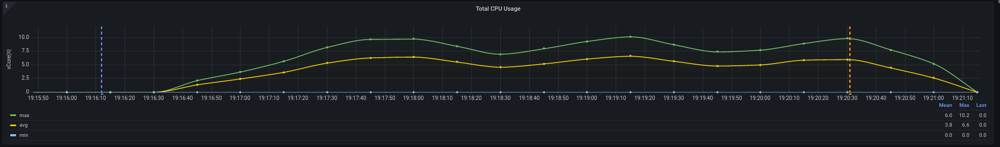

Average CPU Usage

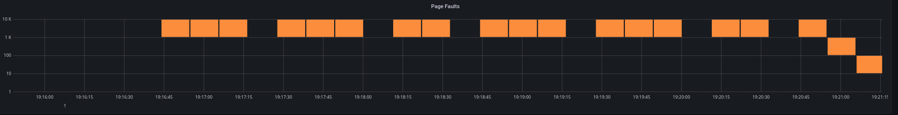

Page faults

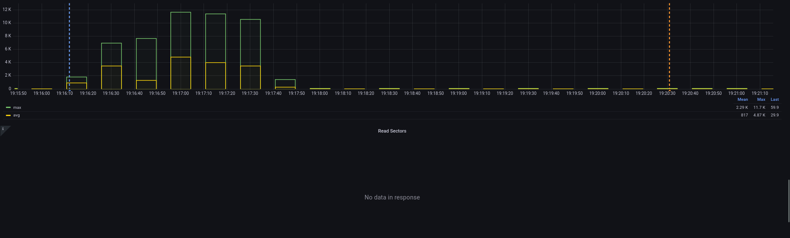

Accessed Sectors

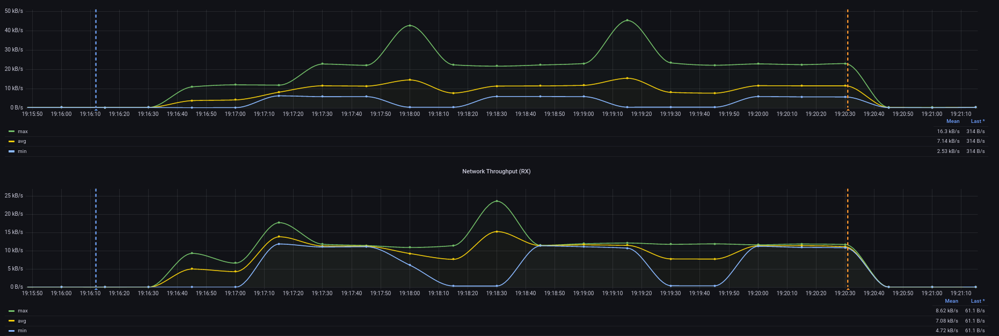

Network Throughput

### 2. Throttled Server

1. Start 1 Flower server low on resources (1 vCPU)
2. Download the dataset into a shared volume that will be shared with the clients.
3. Start 3 clients

| History (~ 4min) | Loss               | Distributed |
| ---------------- | ------------------ | ----------- |
| round 1          | 2.0968997478485107 |             |
| round 2          | 1.6811288595199585 |             |
| round 3          | 1.5280077457427979 |             |

#### Observations

* ..

#### Metrics

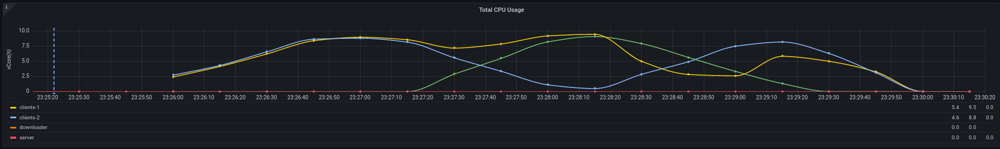

Average CPU Usage

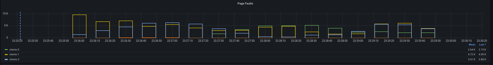

Page faults

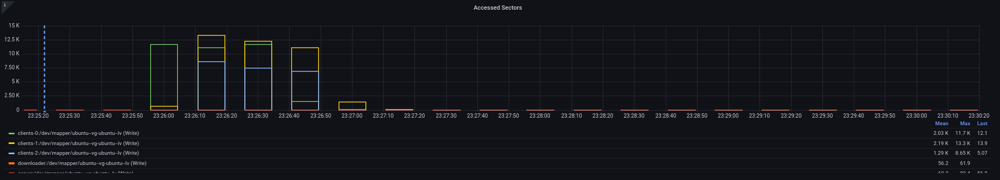

Accessed Sectors

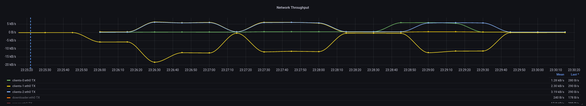

Network Throughput

### 3. Throttled Client

1. Start 1 Flower server
2. Download the dataset into a shared volume that will be shared with the clients.
3. Start 2 Flower clients
4. Start 1 Flow client low on resources (1 vCPU)

| History (~ 28min) | Loss               | Distributed |
| ----------------- | ------------------ | ----------- |
| round 1           | 1.998113751411438  |             |
| round 2           | 1.6380009651184082 |             |
| round 3           | 1.5157533884048462 |             |

#### Observations

* One slow node can kill the entire training
    * Increases training time. Follows the Amdahl's law.
    * Reduces accuracy. I assume that due to the prolonged execution the rolling averages spread over time and cause
      time skews in the calculations.

#### Metrics

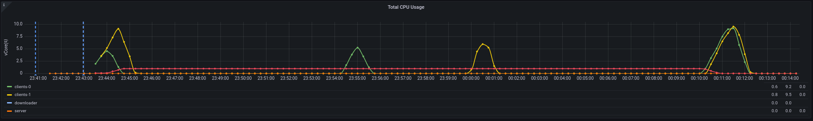

Average CPU Usage

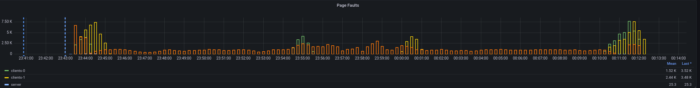

Page faults

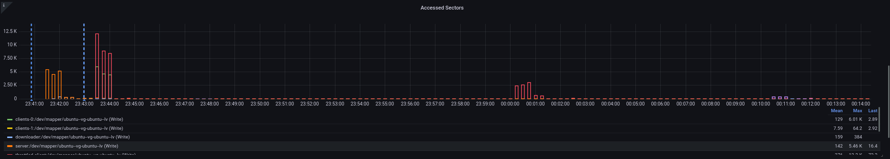

Accessed Sectors

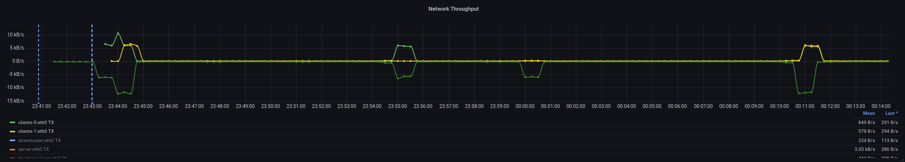

Network Throughput

### 4A. Partition Server-To-Clients

1. Start 1 Flower server
2. Download the dataset into a shared volume that will be shared with the clients.
3. Start 3 Flower clients
4. Make the server unreachable to and from all clients, **before any client start sending traffic.**

| History        | Loss | Distributed |
| -------------- | ---- | ----------- |
| Never Finished |      |             |
|                |      |             |
|                |      |             |

#### Observations

* The clients fail, but are not terminated
    * Failed to pick subchannel"
* The clients have local activity, until the first round where it detects the failure

#### Metrics

Average CPU Usage

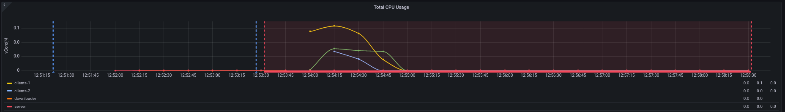

Page faults

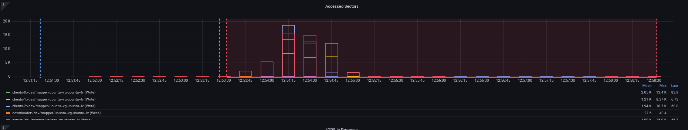

Accessed Sectors

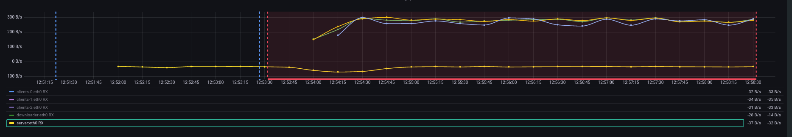

Network Throughput

### 4B. Partition Server-To-Clients

1. Start 1 Flower server
2. Download the dataset into a shared volume that will be shared with the clients.
3. Start 3 Flower clients
4. Make the server unreachable to and from all clients, **after clients have started sending traffic.**

| History        | Loss | Distributed |
| -------------- | ---- | ----------- |
| Never Finished |      |             |
|                |      |             |
|                |      |             |

#### Observations

* Recipe for destruction.

    * 2 clients detect the failure.
    * 1 client does not detect the failure
    * The server does not detect the failure

* They both behave normally, but without making any progress

#### Metrics

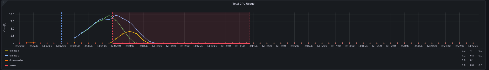

Average CPU Usage

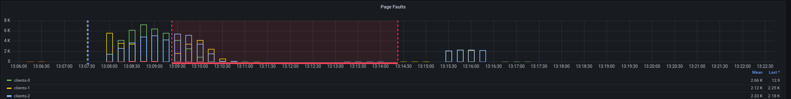

Page faults

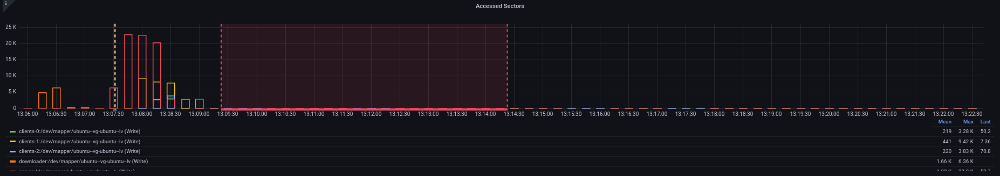

Accessed Sectors

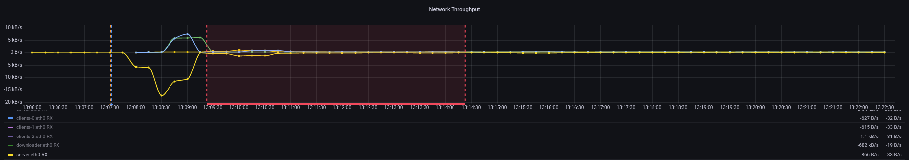

Network Throughput

### 5. Partition Client-to-Server

1. Start 1 Flower server
2. Download the dataset into a shared volume that will be shared with the clients.
3. Start 3 Flower clients
4. Make client-0 unreachable to and from the server.

| History (~3.30min) | Loss               | Distributed |
| ------------------ | ------------------ | ----------- |
| round 1            | 2.2510666847229004 |             |
| round 2            | 1.6967562437057495 |             |
| round 3            | 1.5192006826400757 |             |

#### Observations

* Client-0 detects the error
* Client-1 and Client-2 work normally

#### Metrics

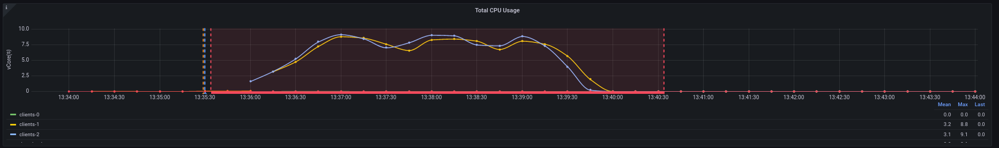

Average CPU Usage

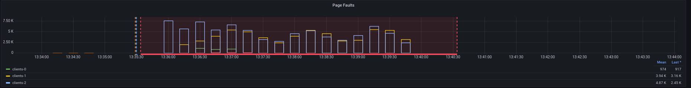

Page faults

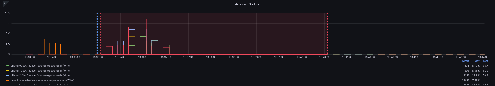

Accessed Sectors

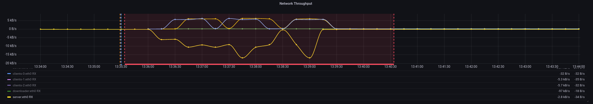

Network Throughput

### 6. Partition Client-to-Client

1. Start 1 Flower server
2. Download the dataset into a shared volume that will be shared with the clients.
3. Start 3 Flower clients
4. Make client-0 unreachable from other clients (but not from the server)

| History (~4.30min) | Loss               | Distributed |
| ------------------ | ------------------ | ----------- |
| round 1            | 2.1528310775756836 |             |
| round 2            | 1.669345498085022  |             |
| round 3            | 1.5152634382247925 |             |

#### Observations

* No client reports the error

#### Metrics

Average CPU Usage

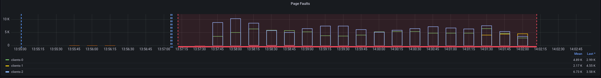

Page faults

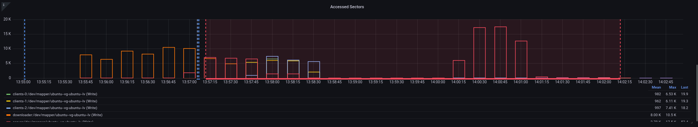

Accessed Sectors

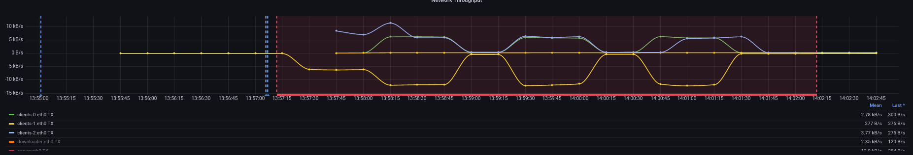

Network Throughput

### 7. Network Loss

1. Start 1 Flower server
2. Download the dataset into a shared volume that will be shared with the clients.
3. Start 3 Flower clients
4. Make the server to lose 25% of the traffic

| History | Loss               | Distributed |
| ------- | ------------------ | ----------- |
| round 1 | 1.905974268913269  |             |
| round 2 | 1.6126952171325684 |             |
| round 3 | 1.4758493900299072 |             |

#### Observations

* Neithers clients nor the server detected the failure.

#### Metrics

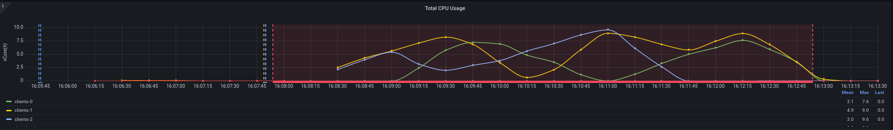

Average CPU Usage

Page faults

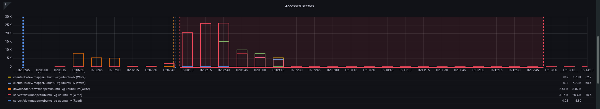

Accessed Sectors

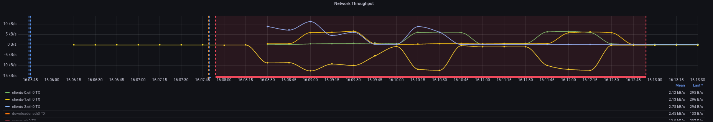

Network Throughput

### 8. Network Duplicates

1. Start 1 Flower server
2. Download the dataset into a shared volume that will be shared with the clients.
3. Start 3 Flower clients
4. Make the server to receive 40% duplicate traffic

| History | Loss               | Distributed |
| ------- | ------------------ | ----------- |
| round 1 | 2.0752482414245605 |             |
| round 2 | 1.7581167221069336 |             |
| round 3 | 1.5365952253341675 |             |

#### Observations

* Neither clients nor the server detected the failure.

#### Metrics

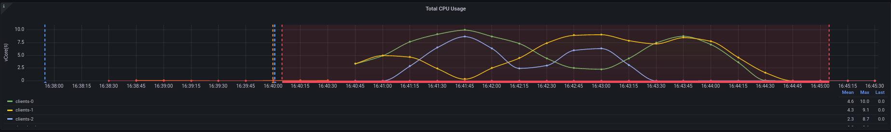

Average CPU Usage

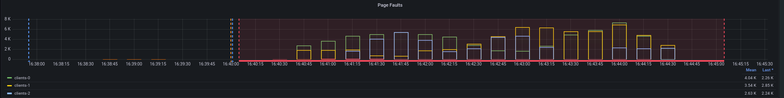

Page faults

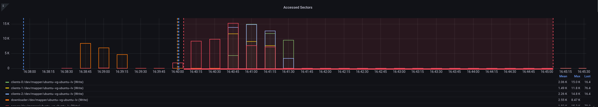

Accessed Sectors

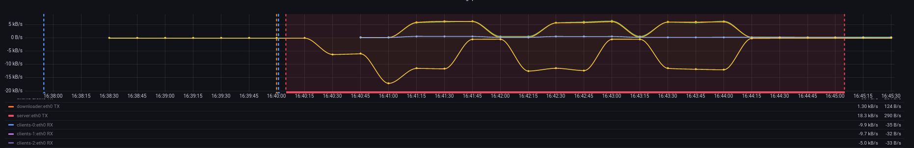

Network Throughput

### 9. Network Delay

1. Start 1 Flower server
2. Download the dataset into a shared volume that will be shared with the clients.
3. Start 3 Flower clients
4. Make server traffic delay 120ms

| History (~4.45min) | Loss               | Distributed |
| ------------------ | ------------------ | ----------- |
| round 1            | 2.003849983215332  |             |
| round 2            | 1.663912057876587  |             |
| round 3            | 1.5070706605911255 |             |

#### Observations

* Neither clients nor the server detected the failure.

#### Metrics

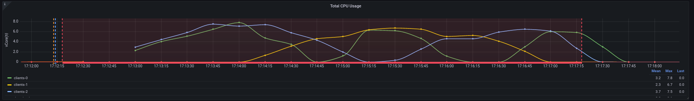

Average CPU Usage

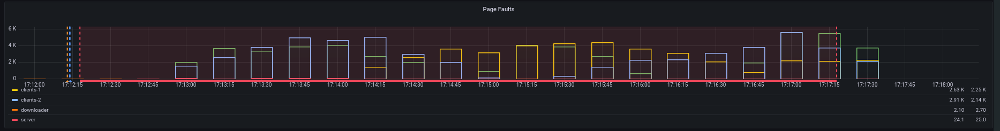

Page faults

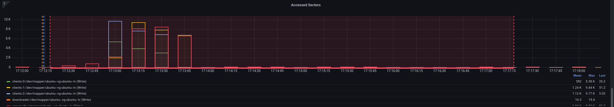

Accessed Sectors

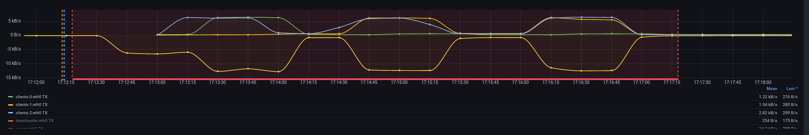

Network Throughput

### 10. Scheduled Join

1. Start 1 Flower server
2. Download the dataset into a shared volume that will be shared with the clients.
3. Start 3 Flower clients, 1 every 5 minutes

| History | Loss               | Distributed |
| ------- | ------------------ | ----------- |
| round 1 | 2.068521022796631  |             |
| round 2 | 1.673058032989502  |             |
| round 3 | 1.5220290422439575 |             |

#### Observations

* Realized that the server requires only two clients to work.

#### Metrics

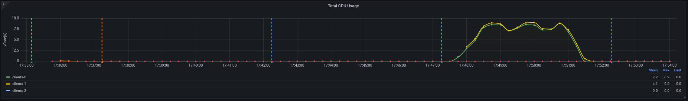

Average CPU Usage

Page faults

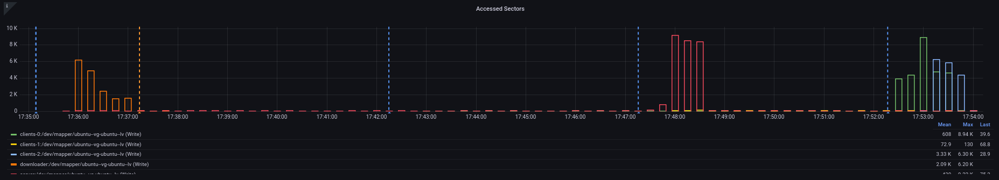

Accessed Sectors

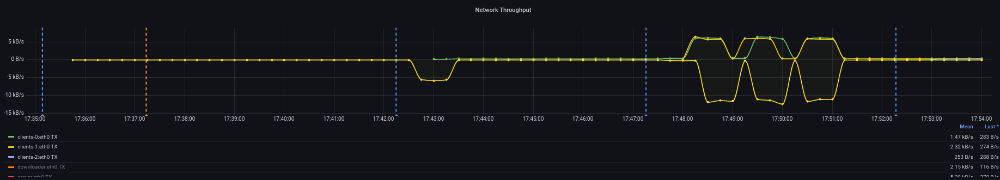

Network Throughput

### 11a. Scaled Baseline, 30 Clients

1. Start server that expects 30 clients
2. Download the dataset into a shared volume that will be shared with the clients.
3. Start 30 clients

| History (~2.30h) | Loss               | Distributed |
| ---------------- | ------------------ | ----------- |
| round 1          | 2.0025325325235354 |             |
| round 2          | 1.6564564564576558 |             |
| round 3          | 1.5153456432132434 |             |

#### Observations

* The experiment works only if FL_MIN_AVAILABLE_CLIENTS==FL_MIN_FIT_CLIENTS==joined clients

    * Otherwise, additional nodes exit in failure

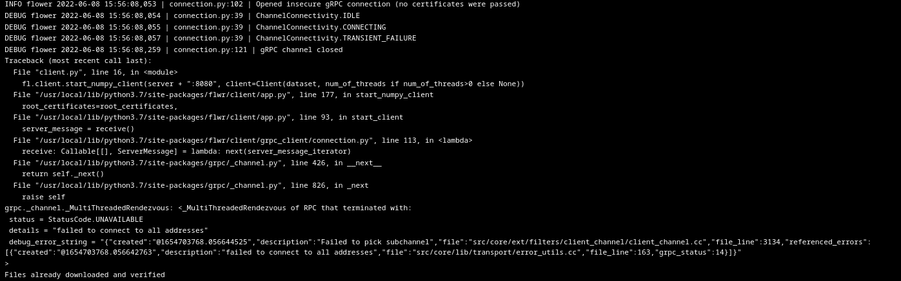

* 30 clients hit the CPU capacity of the cluster

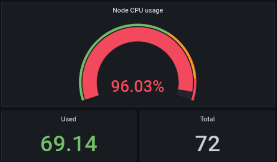

#### Metrics

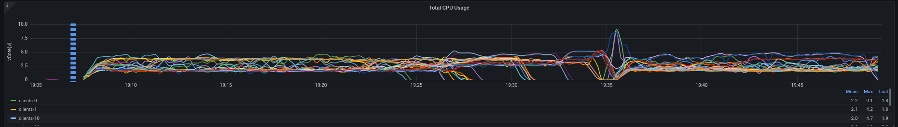

Average CPU Usage

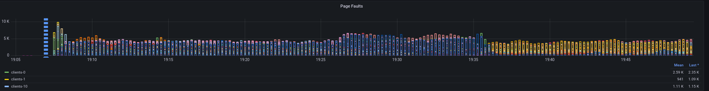

Page faults

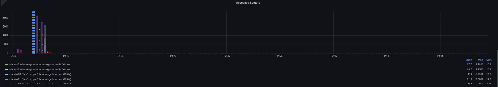

Accessed Sectors

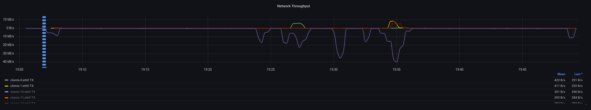

Network Throughput

### 11b. Scaled Baseline, 12 Clients

1. Start server that expects 12 clients
2. Download the dataset into a shared volume that will be shared with the clients.
3. Start 10 clients

| History (~50m) | Loss               | Distributed |
| -------------- | ------------------ | ----------- |
| round 1        | 2.243218421936035  |             |
| round 2        | 1.7176001071929932 |             |
| round 3        | 1.5219959020614624 |             |

####    

#### Observations

*

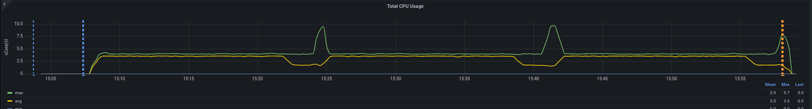

Average CPU Usage

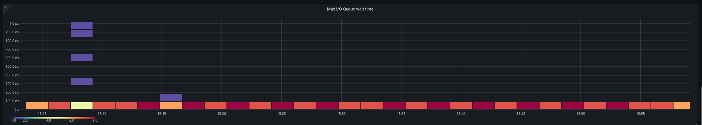

Page faults

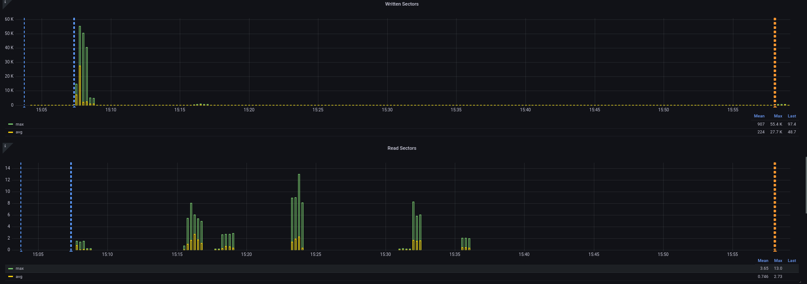

Accessed Sectors

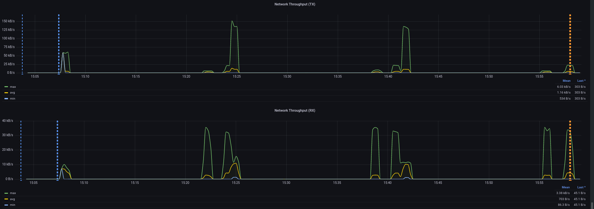

Network Throughput

### 11c. Scaled Baseline, 10 Clients

1. Start server that expects 10 clients
2. Download the dataset into a shared volume that will be shared with the clients.
3. Start 10 clients

| History (~48.9m) | Loss               | Distributed |
| ---------------- | ------------------ | ----------- |
| round 1          | 1.9093841314315796 |             |
| round 2          | 1.6616249084472656 |             |
| round 3          | 1.5116339921951294 |             |

####    

#### Observations

Average CPU Usage

Page faults

Accessed Sectors

Network Throughput

### 11c. Scaled Baseline, 7 Clients

1. Start server that expects 7 clients
2. Download the dataset into a shared volume that will be shared with the clients.
3. Start 7 clients

| History (~6.5m) | Loss               | Distributed |
| --------------- | ------------------ | ----------- |
| round 1         | 2.0500011444091797 |             |
| round 2         | 1.687509298324585  |             |
| round 3         | 1.5112173557281494 |             |

####    

#### Observations

* Because all the clients start simultaneously, the scheduling is inefficient.
    * The scheduler sees 0 activity and collocates the clients. But then the traffic begins, and everything does down.

Average CPU Usage

Page faults

Accessed Sectors

Network Throughput

### 11c. Scaled Baseline, 9 Clients

1. Start server that expects 9clients
2. Download the dataset into a shared volume that will be shared with the clients.
3. Start 9 clients

| History (~6.1m) | Loss               | Distributed |
| --------------- | ------------------ | ----------- |
| round 1         | 1.97438645362854   |             |
| round 2         | 1.6904945373535156 |             |
| round 3         | 1.5080753564834595 |             |

####    

#### Observations

* Because all the clients start simultaneously, the scheduling is inefficient.
    * The scheduler sees 0 activity and collocates the clients. But then the traffic begins, and everything does down.

Average CPU Usage

Page faults

Accessed Sectors

Network Throughput
