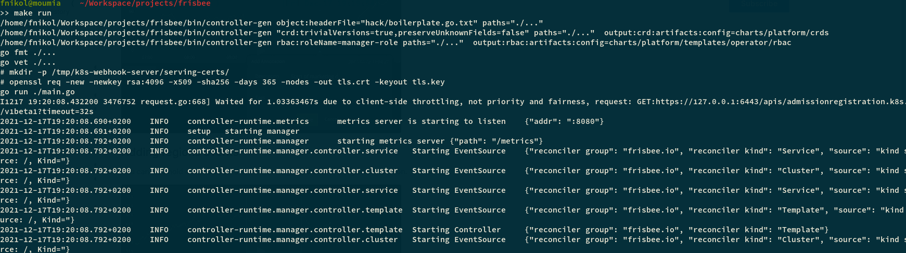
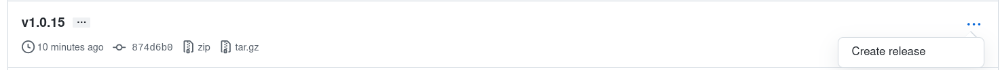

# Guide for the Frisbee Platform Developers

<!-- toc -->

- [Change the Code](#change-the-code)
- [Make a new release](#make-a-new-release)
    - [Step 1: Change the version in the VERSION file](#step-1-change-the-version-in-the-version-file)
    - [Step 2: Update the controller's container](#step-2-update-the-controllers-container)
    - [Step 3: Update the Github repo](#step-3-update-the-github-repo)
    - [Step 4: Create  GitHub release](#step-4-create--github-release)
    - [Step 5: Validate release](#step-5-validate-release)

<!-- /toc -->


## Change the Code

```bash
# Fetch Frisbee
>> git clone git@github.com:CARV-ICS-FORTH/frisbee.git
>> cd frisbee
```

There are two ways to run a Frisbee controller.

- As Go program outside a cluster.
- As a container inside a Kubernetes cluster.

By default, Frisbee prefers the second way.

However, when debugging a few feature it is impractical to have to create and deploy the container all the time. In such
cases, it is preferable to run the controller outside the cluster, as shown next.

**Step 1:**

Firstly, we have to inform the Helm chart responsible for handling the platform deployment to not include the
controller.

```bash
# Remove the containerized controller from a running deployment
>> helm upgrade --install  my-frisbee ./charts/platform/ --set operator.enabled=false -f ./charts/platform/values.yaml
```

Notice we the flag `global.ingress` . Set it accordingly to the Ingress in your cluster.

If you run Frisbee on a local cluster, simply omit the flag.

**Step 2:**

On the second step, we need to run the controller as a standalone binary.

```bash
# Run Frisbee controller outside a cluster (from Frisbee directory)
>> make run
```

This may take a while as it has to take download the Go dependencies and compile the binary.

If everything went fine, you should see something like the following.




> Tip: Beware the different between `charts/platform` and  `frisbee/platform`.

Given that we are under the Frisbee directory, the `charts/platform` points to the local copy of the chart, which is the
one we want to modify.

Otherwise, if `frisbee/platform` is used, Helm will use the released version of the repo.

## Make a new release

#### Step 1: Change the version in the VERSION file

#### Step 2: Update the controller's container

If you have changes anything outside the `charts` folder, then you have probably modified some of the controller.

In this case, you have to rebuild the container and push it to the registry.

```bash
make docker-build IMG="yourImage"
```

Otherwise, you can use which will rebuild and automatically publish the container into the public Docker Hun registry,
under the name [icsforth / frisbee-operator](https://hub.docker.com/repository/docker/icsforth/frisbee-operator)

```bash
>> make docker push
```

#### Step 3: Update the Github repo

We have also automated the way to publish new releases in Github.

```bash
>> make release
```

This will commit and tag all the changes in the repo. However, it will push changes to the Github.

You have to do it manually using

```bash
>> git push --set-upstream origin  && git push --tags
```

#### Step 4: Create  GitHub release

1. Go to GitHub and create a pull request

2. Merge pull request

3. Delete branch

4. Go to [GitHub Tags](https://github.com/CARV-ICS-FORTH/frisbee/tags ) and create a new release for the latest tag

The previous must have triggered some GitHub Actions. Go to https://github.com/CARV-ICS-FORTH/frisbee/actions and check
that is everything is successful.

Then go to the [tags](https://github.com/CARV-ICS-FORTH/frisbee/tags) and create a new release for the latest tag.



#### Step 5: Validate release

The previous step have triggered the appropriate action for creating new charts.

To confirm that they have been actually created, you can use the  `helm` tool to search the repo.

```bash
>> helm repo update
>> helm search repo frisbee
```

Then, you see that the `latest` Chart version is equal to the latest `git tag`, and in accordance to the VERSION file.

